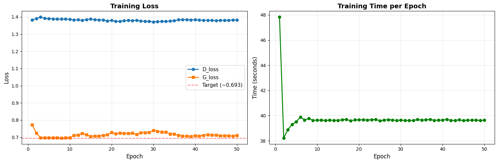

# DCGAN for CIFAR-10 Image Generation

<div align="center">


*Deep Convolutional Generative Adversarial Network untuk menghasilkan gambar CIFAR-10 32x32*

</div>

---

## 📋 Daftar Isi

- [Overview](#overview)
- [Arsitektur](#arsitektur)
- [Hasil Training](#hasil-training)
- [Instalasi](#instalasi)
- [Cara Penggunaan](#cara-penggunaan)
- [Hyperparameter](#hyperparameter)
- [Tips & Troubleshooting](#tips--troubleshooting)
- [Referensi](#referensi)

---

## 🎯 Overview

Implementasi **DCGAN (Deep Convolutional GAN)** yang dioptimalkan untuk dataset CIFAR-10. Model ini mampu menghasilkan gambar 32x32 pixel yang realistis dari 10 kategori objek (pesawat, mobil, burung, kucing, rusa, anjing, katak, kuda, kapal, truk).

### ✨ Fitur Utama

- ✅ **Optimized Training**: Learning rate berbeda untuk Generator dan Discriminator
- ✅ **Stable Convergence**: Label smoothing konservatif untuk mencegah mode collapse
- ✅ **Real-time Visualization**: Live preview gambar setiap beberapa epoch
- ✅ **TensorBoard Integration**: Monitor training metrics secara real-time
- ✅ **Google Colab Ready**: Plug-and-play untuk training di cloud

---

## 🏗️ Arsitektur

### Generator

```
Input: Latent Vector (128-dim)
    ↓
Dense → Reshape → 4×4×512
    ↓
Conv2DTranspose → 8×8×256
    ↓
Conv2DTranspose → 16×16×128
    ↓
Conv2DTranspose → 32×32×64
    ↓
Conv2D → 32×32×3 (Output)
```

**Total Parameters**: ~3.5M

### Discriminator

```
Input: Image 32×32×3
    ↓
Conv2D → 16×16×64
    ↓
Conv2D → 8×8×128
    ↓
Conv2D → 4×4×256
    ↓
Flatten → Dense → 1 (Real/Fake)
```

**Total Parameters**: ~1.2M

---

## 📊 Hasil Training

### Training Metrics (50 Epochs)

| Metric | Value |
|--------|-------|
| **Average D_loss** | 1.3816 |
| **Average G_loss** | 0.7146 |
| **Training Time** | 33.1 minutes |
| **Time per Epoch** | ~39.8s |

### Loss Curves



**Observasi**:
- ✅ D_loss stabil di ~1.38 (konvergen tanpa oscillation)
- ✅ G_loss turun dari 0.77 → 0.71 (learning konsisten)
- ✅ Tidak ada mode collapse atau divergence
- ✅ Training time konsisten (~40s/epoch)

### Generated Samples

#### Epoch 1 vs Epoch 50 Comparison

| Epoch 1 | Epoch 50 |
|---------|----------|
| Noise random | Objek recognizable |
| Warna monoton | Warna realistis |
| Tidak ada struktur | Struktur jelas |


**Kualitas Visual**:
- ✅ Objek dengan struktur jelas (pesawat, kendaraan, hewan)
- ✅ Warna realistis dan bervariasi
- ✅ Konteks yang masuk akal (langit biru, tanah hijau/coklat)
- ⚠️ Sedikit blur (normal untuk CIFAR-10 32×32)

---

## 🚀 Instalasi

### Requirements

```bash
tensorflow>=2.10.0
numpy>=1.21.0
matplotlib>=3.5.0
imageio>=2.19.0
```

### Install Dependencies

```bash
pip install tensorflow numpy matplotlib imageio
```

### Clone Repository

```bash
git clone https://github.com/yourusername/dcgan-cifar10.git
cd dcgan-cifar10
```

---

## 💻 Cara Penggunaan

### Quick Start (Google Colab)

```python
# 1. Copy semua code ke cell Colab

# 2. Load dataset
dataset = load_cifar10()

# 3. Train model
history = train(dataset, epochs=50)

# 4. Create GIF dari training progression
create_gif()

# 5. Generate random samples
generate_random_samples(36)

# 6. Lihat interpolasi latent space
interpolate_images(10)
```

### Training di Local Machine

```python
# Pastikan TensorFlow sudah terinstall
import tensorflow as tf
print(tf.__version__)

# Run training
dataset = load_cifar10()
history = train(dataset, epochs=50)
```

### Load Pre-trained Model

```python
# Create model instance
dataset = load_cifar10()

# Build models
generator = build_generator()
discriminator = build_discriminator()

# Setup checkpoint
checkpoint = tf.train.Checkpoint(
    generator=generator,
    discriminator=discriminator
)

# Restore dari checkpoint
checkpoint.restore('checkpoints/ckpt-5')

# Generate samples
generate_random_samples(25)
```

---

## ⚙️ Hyperparameter

### Konfigurasi Optimal (Tested)

```python
# Image settings
IMG_SIZE = 32
LATENT_DIM = 128

# Training settings
BATCH_SIZE = 128
EPOCHS = 50

# Learning rates (CRITICAL!)
LR_GEN = 2e-4      # Generator learning rate
LR_DISC = 1e-4     # Discriminator learning rate (setengah dari G)
BETA_1 = 0.5       # Adam beta_1

# Label smoothing (Conservative)
REAL_LABEL_RANGE = (0.9, 1.0)  # Real images
FAKE_LABEL_RANGE = (0.0, 0.1)  # Fake images

# Regularization
DROPOUT_RATE = 0.2  # Di Discriminator
```

### Penjelasan Hyperparameter Kunci

#### 1. **Learning Rate Berbeda**
```python
LR_GEN = 2e-4   # G belajar lebih cepat
LR_DISC = 1e-4  # D belajar lebih lambat
```
**Alasan**: Mencegah D terlalu kuat yang bisa membuat G tidak belajar.

#### 2. **Label Smoothing Konservatif**
```python
REAL_LABEL = random(0.9, 1.0)  # Bukan 1.0 keras
FAKE_LABEL = random(0.0, 0.1)  # Bukan 0.0 keras
```
**Alasan**: Mencegah overconfidence D, training lebih stabil.

#### 3. **Dropout Rendah**
```python
DROPOUT_RATE = 0.2  # Bukan 0.3+
```
**Alasan**: D perlu cukup kuat untuk memberi sinyal berguna ke G.

---

## 🔧 Tips & Troubleshooting

### Problem 1: D_loss Terlalu Tinggi (>1.5)

**Gejala**: D_loss stuck di atas 1.5, tidak turun

**Solusi**:
```python
# Opsi A: Kurangi dropout
DROPOUT_RATE = 0.15  # Dari 0.2

# Opsi B: Naikkan LR Discriminator sedikit
LR_DISC = 1.2e-4  # Dari 1e-4
```

### Problem 2: Mode Collapse

**Gejala**: Semua gambar generated mirip/identik

**Solusi**:
```python
# Opsi A: Turunkan LR Discriminator
LR_DISC = 8e-5  # Dari 1e-4

# Opsi B: Perlonggar label smoothing
FAKE_LABEL_MAX = 0.15  # Dari 0.1
```

### Problem 3: Training Tidak Stabil

**Gejala**: Loss naik-turun drastis

**Solusi**:
```python
# Opsi A: Batch size lebih besar
BATCH_SIZE = 256  # Dari 128

# Opsi B: Label smoothing lebih agresif
REAL_LABEL_MIN = 0.85  # Dari 0.9
FAKE_LABEL_MAX = 0.15  # Dari 0.1
```

### Problem 4: Out of Memory (OOM)

**Solusi**:
```python
# Kurangi batch size
BATCH_SIZE = 64  # Dari 128

# Atau enable mixed precision (GPU only)
tf.keras.mixed_precision.set_global_policy('mixed_float16')
```

---

## 📈 Training Best Practices

### 1. **Monitor Visual Quality, Not Just Loss**

Loss bukan satu-satunya indikator. Cek gambar generated:
- Epoch 10-20: Struktur dasar muncul
- Epoch 20-35: Warna dan detail membaik
- Epoch 35-50: Refinement dan polish

### 2. **Patience is Key**

GAN butuh waktu. Jangan stop terlalu cepat:
- Minimal 30 epochs untuk hasil yang baik
- Optimal 50-75 epochs
- Diminishing returns setelah 100 epochs

### 3. **Checkpoint Regularly**

```python
# Save setiap 10 epochs
CHECKPOINT_EVERY = 10
```

### 4. **Use TensorBoard**

```python
# Di Colab
%load_ext tensorboard
%tensorboard --logdir logs/dcgan

# Di local
tensorboard --logdir logs/dcgan
```

---

## 📚 Referensi

### Paper Asli

- **DCGAN**: Radford, A., Metz, L., & Chintala, S. (2015). [Unsupervised Representation Learning with Deep Convolutional Generative Adversarial Networks](https://arxiv.org/abs/1511.06434). *arXiv preprint arXiv:1511.06434*.

### Dataset

- **CIFAR-10**: Krizhevsky, A., & Hinton, G. (2009). [Learning Multiple Layers of Features from Tiny Images](https://www.cs.toronto.edu/~kriz/cifar.html). *Technical report, University of Toronto*.

### Inspirasi & Resources

- [TensorFlow GAN Tutorial](https://www.tensorflow.org/tutorials/generative/dcgan)
- [PyTorch DCGAN Tutorial](https://pytorch.org/tutorials/beginner/dcgan_faces_tutorial.html)
- [GAN Training Tips](https://github.com/soumith/ganhacks)

---

## 📝 License

MIT License - feel free to use untuk research atau personal projects.

---

## 🙏 Acknowledgments

- Dataset: CIFAR-10 by Alex Krizhevsky
- Framework: TensorFlow/Keras
- Architecture: DCGAN by Radford et al.
- Platform: Google Colab untuk free GPU access


<div align="center">

**Happy Training! 🚀**

*Made with ❤️ for the AI community*

</div>
